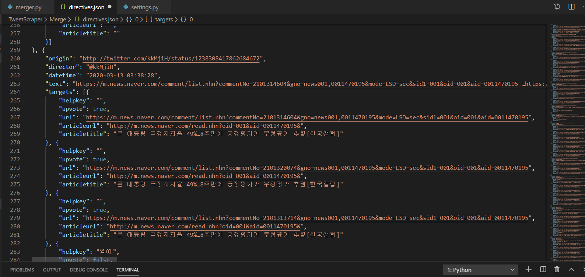

# Get Recommendation Abuser On Twitter!

## 목적

- 포털뉴스 댓글의 추천수 조작을 요청하는 최신 트위터 지령들을 크롤링합니다. 이들을 취합해서 하나의 JSON 객체로 제공합니다. 추천 수 조작 행위를 모니터링하는 RESTful API 구현을 위한 기저 로직으로 이용할 목적입니다.
- 크롤링 툴은 [jonbakerfish/TweetScraper](https://github.com/jonbakerfish/TweetScraper) 를 이용합니다. 
- [jonbakerfish/TweetScraper](https://github.com/jonbakerfish/TweetScraper)는 잘 정의된 트위터 크롤링 툴로 생각됩니다. settings를 손 보면 트위터에서 필요한 정보를 긁는 데 이용할 수 있습니다. 

## 실행 준비

레포지토리 루트 디렉토리에서,

```bash
$ cd ./TweetScraper/
$ pip install -r requirements.txt  #add '--user' if you are not root
$ scrapy list
$ #If the output is 'TweetScraper', then you are ready to go.
```

## 실행

크롤러만을 실행하고 싶다면 레포지토리의 루트 디렉토리에서,

```bash
python ./DirectiveMerger/main.py
```

REST API 서버와 크롤러를 동시에 실행시키고 싶다면
```bash
python manage.py runserver 0.0.0.0:{port}
```

## 단번에 실행하기

서비스의 도커 이미지를 사용하여 별다른 설정 없이 서비스를 실행할 수 있습니다.

**레포지토리의 루트 디렉토리에서**,

```bash
[windows]
> docker run -it -d -v %cd%:/myservice -p {port}:8000 --name tweetmonitor xentai/tweetmonitor

[linux]
> docker run -it -d -v $(pwd):/myservice -p {port}:8000 --name tweetmonitor xentai/tweetmonitor 
```

## 수정 및 실행 시 주의사항

서비스 실행 중에 장고 서버의 소스코드를 변경하면 서비스가 자동으로 재시작되지 않고 멈추어 버릴 것입니다. 종료되지 않는 크롤러를 병렬실행 하고 있는 게 원인이라 생각됩니다.

그러므로 소스코드 변경사항을 새로이 적용하려면 manage.py를 재시작 해야 합니다.

도커 이미지를 이용한 경우 컨테이너를 재시작 합니다. `docker restart tweetmonitor` 

## 결과물

### 파일

- `./TweetScraper/Data/tweet/` 에 개별적인 지령이 JSON 형태로 **임시 저장**됩니다. 병합 작업 후 전부 제거됩니다.

- `./TweetScraper/Merge/directives.json` 에는 크롤링 된 최신 지령들이 취합되어 JSON 형태로 저장됩니다.

  

- `./TweetScraper/Merge/log.txt` 는 크롤러 동작을 간단히 로깅합니다.

### Web

`http://{host}:{port}/rest/directives`로 요청하면 `directives.json`을 제공받습니다.

### JSON 형식

`directives.json`에 저장되는 정보는 아래와 같습니다.

```json
[{
    "origin": "원문 링크",
    "director": "지시자",
    "datetime": "지시시각",
    "text": "지시문",
    "targets": [{
        "helpkey": "주석",
        "upvote": "true|false",
        "url": "목표 링크",
        "articleurl": "목표 기사 링크",
        "articletitle": "목표 기사 제목"
    }, ...]
}, ...
]
```

## 종료

크롤러는 강제종료 되기까지 반복적인 크롤링을 합니다. `ctrl+c` 로 종료하십시오.

API 웹 서버 역시 `ctrl+c`를 눌러 종료하십시오.

## 세팅

`./DirectiveMerger/settings.py`

```python
#DATE
TODAY = datetime.today()

YESTERDAY = TODAY - timedelta(days=1)

SINCE = TODAY - timedelta(days=2)

#CRAWLER
CRAWLER_ROOT_DIRECTORY = './TweetScraper/'

CRAWLER_NAME = 'TweetScraper'

CRAWLER_RESULT_PATH =  './TweetScraper/Data/tweet' # directory

CRAWLER_FILTERS = " " + " ".join([ 
    "filter:links", 
    "since:"+ SINCE.strftime("%Y-%m-%d")
    ]
)

CRAWLER_QUERY = 'query="역따"' + CRAWLER_FILTERS

CRAWLER_TASK_INTERVAL = 3*60 # min * sec

#MERGER
MERGER_RESULT_PATH = './TweetScraper/Merge/directives.json' # json format output file

#LOGGER
LOGGER_RESULT_PATH = './TweetScraper/Merge/log.txt' 
```

- ##DATE 구역에 있는 변수들은 날짜를 의미합니다.  `SINCE` 변수에 날짜 값을 설정하면 크롤러는 해당 날짜부터 시작하여 지령을 크롤링합니다.
- `CRAWLER_QUERY` 를 변경하면 원하는 정보를 검색할 수 있습니다. 사용할 수 있는 쿼리는 [jonbakerfish/TweetScraper](https://github.com/jonbakerfish/TweetScraper) 를 참고합니다.
- `CRAWLLER_FILTERS`의 리스트에 필터 문장을 추가할 수 있습니다.
- `CRAWLER_TASK_INTERVAL` 는 크롤링 동작 주기를 의미합니다.
- `MERGER_RESULT_PATH` 는  취합된 트윗을 저장할 파일을 지정합니다.
- `LOGGER_RESULT_PATH` 는 로그를 저장할 파일을 지정합니다.
- 언급하지 않은 변수는 변경하지 않습니다.

## 라이센스
DirectiveMerger는 [GNU GENERAL PUBLIC LICENSE, Version 2](https://github.com/binchoo/GetRecommendationAbuserOnTwitter/blob/master/LICENSE) 라이센스 하에 배포됩니다.
